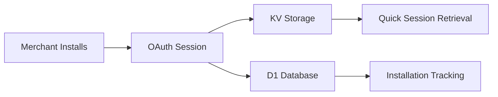

# Custom Variant Discounts - Cloudflare Architecture & Development Guide

**Date**: January 28, 2025  
**Author**: Technical Architecture Analysis  
**App**: Custom Variant Discounts (SKU Custom Discount)

## Table of Contents
1. [Executive Summary](#executive-summary)
2. [Current Architecture Overview](#current-architecture-overview)
3. [Cloudflare Services Usage](#cloudflare-services-usage)
4. [Data Storage & Session Management](#data-storage--session-management)
5. [Deployment Process](#deployment-process)
6. [Security & Secrets Management](#security--secrets-management)
7. [Latest Cloudflare Features (2025)](#latest-cloudflare-features-2025)
8. [Comparison: Cloudflare vs Railway vs Gadget](#comparison-cloudflare-vs-railway-vs-gadget)
9. [Best Practices & Recommendations](#best-practices--recommendations)

---

## Executive Summary

Your Shopify app is built on **Cloudflare Workers** with a modern edge-first architecture. This guide explains exactly how your app works, what services you're using, and whether you're following 2025 best practices.

### Key Findings:
- ✅ Using latest Cloudflare Workers runtime (compatibility_date: "2025-01-27")
- ✅ Edge-first architecture with global distribution
- ⚠️ Mixed database approach (SQLite local + D1 cloud)
- ⚠️ API secrets in wrangler.toml (functional but not ideal)
- ✅ Proper session management with KV storage
- ✅ Following Shopify's recommended patterns

---

## Current Architecture Overview

### Tech Stack
```
Frontend:         Remix (React-based)
Backend:          Cloudflare Workers (Edge Runtime)
Database:         D1 (Cloudflare's SQLite) + Local SQLite
Session Storage:  KV (Key-Value) Namespace
Discount Logic:   Rust (compiled to WASM)
Framework:        Shopify Remix Template
```

### How It Works

1. **Request Flow**:
   ```
   Merchant → Shopify Admin → Your App URL (Cloudflare Worker)
   → Remix Handler → Your App Logic → Response
   ```

2. **Authentication Flow**:
   ```
   OAuth Request → Cloudflare Worker → Shopify OAuth
   → Session stored in KV → Redirect to App
   ```

3. **Discount Application**:
   ```
   Customer Checkout → Shopify Functions → Your Rust Function
   → Apply variant-specific discounts
   ```

---

## Cloudflare Services Usage

### 1. **Workers** (Core Runtime)
- **What**: Serverless JavaScript runtime at the edge
- **Usage**: Running your entire Remix app
- **Config**: `server.ts` handles all requests
- **Benefit**: 0ms cold starts, global distribution

### 2. **KV Namespace** (Session Storage)
```javascript
// Current Implementation
binding = "SESSIONS"
id = "8b252d829fc1454182e2c6814bdcae2e"
```
- **Purpose**: Store Shopify session tokens
- **Why KV?**: Fast global reads, eventual consistency perfect for sessions
- **Data**: OAuth tokens, shop info, user details

### 3. **D1 Database** (Application Data)
```javascript
binding = "DB"
database_name = "sku-discount-db"
database_id = "0ce2dfcb-1c94-4ee8-b630-8349cc9a54b3"
```
- **Purpose**: Store shop installations, settings, logs
- **Tables**: 
  - `shops`: Active installations
  - `installation_logs`: Install/uninstall history
  - `app_settings`: Shop-specific configurations
  - `Session`: Prisma session table (currently unused in D1)

### 4. **Wrangler** (Deployment Tool)
- **Version**: 4.26.0 (latest as of Jan 2025)
- **Purpose**: Deploy, manage, and configure Workers

---

## Data Storage & Session Management

### Current Implementation

1. **Session Storage (KV)**:
   ```typescript
   // shopify.server.ts
   const sessionStorage = new KVSessionStorage(env.SESSIONS);
   ```
   - Stores OAuth sessions
   - Automatically managed by Shopify's KV adapter
   - Global replication for fast access

2. **Shop Data (D1)**:
   ```sql
   -- shops table tracks installations
   CREATE TABLE shops (
     shop TEXT UNIQUE NOT NULL,
     installed_at DATETIME,
     is_active BOOLEAN DEFAULT TRUE
   );
   ```

3. **Local Development (SQLite)**:
   ```prisma
   datasource db {
     provider = "sqlite"
     url      = "file:dev.sqlite"
   }
   ```
   - Used ONLY in development
   - NOT used in production Cloudflare deployment

### Data Flow


---

## Deployment Process

### Current Deployment Steps

1. **Build Process**:
   ```bash
   npm run build:cf
   # Runs: remix vite:build --config vite.config.cloudflare.ts
   # Creates optimized Worker bundle
   ```

2. **Deploy to Cloudflare**:
   ```bash
   npm run deploy:cf
   # Runs: wrangler deploy
   # Uploads to Cloudflare edge network
   ```

3. **What Happens**:
   - Code bundled with Vite
   - Uploaded to Cloudflare's global network
   - Available at 200+ data centers worldwide
   - Zero downtime deployment

### Environment Configuration
```toml
# wrangler.toml
name = "sku-custom-discount-production"
compatibility_date = "2025-01-27"
```

---

## Security & Secrets Management

### Current State
```toml
# wrangler.toml - CURRENT (Not Ideal)
[vars]
SHOPIFY_API_KEY = "3122acfb32ed2de15a381bde53864f1f"
SHOPIFY_API_SECRET = "640cbc2a69ce6306bf4f25a78ff17c56"  # ⚠️ Exposed
```

### Best Practice Implementation
```bash
# Step 1: Add secrets securely
wrangler secret put SHOPIFY_API_SECRET

# Step 2: Remove from wrangler.toml
[vars]
SHOPIFY_API_KEY = "3122acfb32ed2de15a381bde53864f1f"
# SHOPIFY_API_SECRET removed - now in encrypted secrets

# Step 3: Access in code (no changes needed)
// Already works with env.SHOPIFY_API_SECRET
```

### Why This Matters
- **Current**: Secrets visible in Git history
- **Best Practice**: Encrypted at rest, never visible
- **Impact**: Better security, same functionality

---

## Latest Cloudflare Features (2025)

### What You're Using ✅
1. **Latest Compatibility Date**: `2025-01-27`
2. **Node.js Compatibility**: Enabled
3. **Modern Vite Integration**: v6.3.5
4. **D1 Database**: Production-ready SQLite at edge

### What You Could Use 🔄
1. **Durable Objects**: For real-time features
2. **R2 Storage**: For file uploads (if needed)
3. **Queues**: For background job processing
4. **Analytics Engine**: For custom metrics

### Recent Updates (2025)
- **Hyperdrive**: Connect to external databases (PostgreSQL/MySQL)
- **Workers AI**: Run AI models at edge
- **Email Workers**: Handle inbound email
- **Vectorize**: Vector database for AI apps

---

## Comparison: Cloudflare vs Railway vs Gadget

### Cloudflare Workers (Your Choice) ✅

**Pros**:
- **Performance**: 0ms cold starts, edge runtime
- **Scale**: Automatic, no servers to manage
- **Cost**: Pay per request, generous free tier
- **Global**: 200+ locations worldwide
- **Integration**: Native D1, KV, R2 support

**Cons**:
- **Complexity**: More setup than PaaS
- **Limits**: CPU time limits (but generous)
- **Debugging**: Can be challenging

**Best For**: Production apps needing global scale

### Railway 🚂

**Pros**:
- **Simple**: One-click deploys
- **Databases**: PostgreSQL, MySQL, Redis included
- **Traditional**: Standard Node.js environment
- **Logs**: Excellent logging/monitoring

**Cons**:
- **Cost**: More expensive at scale
- **Performance**: Traditional server cold starts
- **Regional**: Not edge-distributed
- **Scale**: Manual scaling required

**Best For**: MVPs, traditional apps

### Gadget 🔧

**Pros**:
- **Shopify-First**: Built specifically for Shopify
- **No-Code Options**: Visual development
- **Managed**: Everything handled for you
- **Quick Start**: Fastest to market

**Cons**:
- **Lock-in**: Proprietary platform
- **Flexibility**: Less customization
- **Cost**: Subscription-based
- **Control**: Less infrastructure control

**Best For**: Non-technical teams, quick prototypes

### Why Cloudflare Wins for Your App

1. **Performance**: Your discount function runs at checkout - speed matters
2. **Scale**: Can handle Black Friday traffic without changes
3. **Cost**: Pay only for what you use
4. **Modern**: Using latest edge computing patterns
5. **Flexibility**: Full control over your infrastructure

---

## Best Practices & Recommendations

### ✅ What You're Doing Right

1. **Edge-First Architecture**: Running on Cloudflare Workers
2. **Proper Session Management**: Using KV for sessions
3. **Database Separation**: D1 for app data, KV for sessions
4. **Modern Stack**: Remix + React + TypeScript
5. **Performance Focus**: Rust for discount calculations

### ⚠️ Improvements Needed

1. **Secret Management**:
   ```bash
   # Move API secret to encrypted storage
   wrangler secret put SHOPIFY_API_SECRET
   ```

2. **Database Consistency**:
   ```javascript
   // Remove local SQLite references in production
   // Use D1 for all production data
   ```

3. **Error Tracking**:
   ```javascript
   // Add Sentry or similar
   import * as Sentry from "@sentry/cloudflare";
   ```

4. **Type Safety**:
   ```typescript
   // Fix TypeScript errors
   // Properly type all API responses
   ```

### 🚀 Future Enhancements

1. **Analytics**:
   ```javascript
   // Use Analytics Engine for custom metrics
   env.ANALYTICS.writeDataPoint({
     blobs: ['discount_created'],
     doubles: [discountAmount]
   });
   ```

2. **Background Jobs**:
   ```javascript
   // Use Queues for async processing
   await env.QUEUE.send({
     type: 'sync_discount',
     shopId: shop
   });
   ```

3. **Caching Strategy**:
   ```javascript
   // Implement proper caching
   const cache = caches.default;
   const cached = await cache.match(request);
   ```

---

## Deployment Commands Reference

```bash
# Local Development
shopify app dev                    # Start local development

# Build & Deploy
npm run build:cf                   # Build for Cloudflare
npm run deploy:cf                  # Deploy to production

# Database Management
wrangler d1 execute sku-discount-db --file=./migrations/0001_create_tables.sql

# Secrets Management
wrangler secret put SHOPIFY_API_SECRET
wrangler secret list

# Logs & Debugging
wrangler tail                      # Live production logs
```

---

## Conclusion

Your Shopify app is using a **modern, scalable architecture** with Cloudflare Workers. You're ahead of the curve compared to traditional hosting solutions. The main improvements needed are:

1. Move API secret to encrypted storage
2. Fix TypeScript errors
3. Add error tracking
4. Consider additional Cloudflare services as you grow

This architecture will scale to millions of requests without changes, costs less than traditional hosting, and provides better performance for merchants globally.