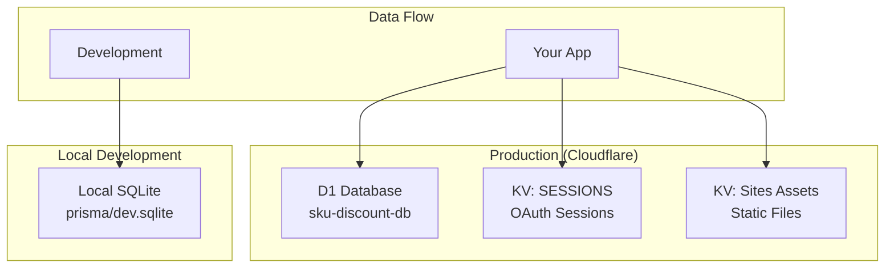
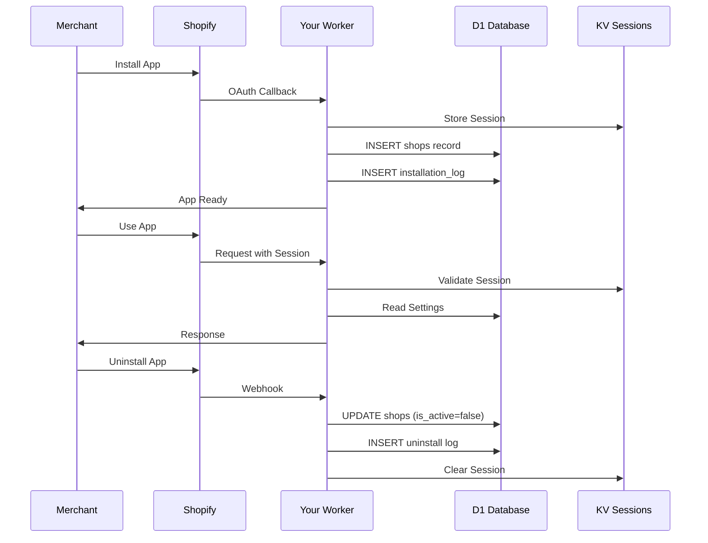

# Complete Database Architecture - Custom Variant Discounts

**Generated**: January 28, 2025  
**App**: Custom Variant Discounts (SKU Custom Discount)

## 📊 Full Database Overview

You have **3 different data storage systems**:



---

## 1️⃣ D1 Database (Production) - `sku-discount-db`

### Complete Schema Visualization

```sql
┌─────────────────────────────────────────────────────────────┐
│                        shops table                           │
├─────────────────────────────────────────────────────────────┤
│ id              │ INTEGER PRIMARY KEY AUTOINCREMENT        │
│ shop            │ TEXT UNIQUE NOT NULL                     │
│ installed_at    │ DATETIME DEFAULT CURRENT_TIMESTAMP       │
│ uninstalled_at  │ DATETIME                                 │
│ is_active       │ BOOLEAN DEFAULT TRUE                     │
│ created_at      │ DATETIME DEFAULT CURRENT_TIMESTAMP       │
│ updated_at      │ DATETIME DEFAULT CURRENT_TIMESTAMP       │
└─────────────────────────────────────────────────────────────┘

┌─────────────────────────────────────────────────────────────┐
│                  installation_logs table                     │
├─────────────────────────────────────────────────────────────┤
│ id              │ INTEGER PRIMARY KEY AUTOINCREMENT        │
│ shop            │ TEXT NOT NULL                            │
│ event_type      │ TEXT CHECK IN ('install','uninstall',    │
│                 │                'reinstall')               │
│ metadata        │ TEXT                                     │
│ created_at      │ DATETIME DEFAULT CURRENT_TIMESTAMP       │
└─────────────────────────────────────────────────────────────┘

┌─────────────────────────────────────────────────────────────┐
│                    app_settings table                        │
├─────────────────────────────────────────────────────────────┤
│ id              │ INTEGER PRIMARY KEY AUTOINCREMENT        │
│ shop            │ TEXT UNIQUE NOT NULL                     │
│ settings        │ TEXT DEFAULT '{}'                        │
│ created_at      │ DATETIME DEFAULT CURRENT_TIMESTAMP       │
│ updated_at      │ DATETIME DEFAULT CURRENT_TIMESTAMP       │
└─────────────────────────────────────────────────────────────┘
```

### Current Data Export

#### **shops** (2 records)
```json
[
  {
    "id": 1,
    "shop": "discount-function-ui.myshopify.com",
    "installed_at": "2025-07-27 20:45:12",
    "uninstalled_at": "2025-07-27 21:01:37",
    "is_active": false,
    "created_at": "2025-07-27 20:45:12",
    "updated_at": "2025-07-27 20:45:12"
  },
  {
    "id": 2,
    "shop": "coach-test1.myshopify.com",
    "installed_at": "2025-07-27 21:04:16",
    "uninstalled_at": null,
    "is_active": true,
    "created_at": "2025-07-27 21:04:16",
    "updated_at": "2025-07-27 21:04:16"
  }
]
```

#### **installation_logs** (17 records - showing recent 5)
```json
[
  {
    "id": 17,
    "shop": "coach-test1.myshopify.com",
    "event_type": "install",
    "metadata": null,
    "created_at": "2025-07-27 21:04:16"
  },
  {
    "id": 16,
    "shop": "discount-function-ui.myshopify.com",
    "event_type": "uninstall",
    "metadata": null,
    "created_at": "2025-07-27 21:01:38"
  },
  {
    "id": 15,
    "shop": "discount-function-ui.myshopify.com",
    "event_type": "reinstall",
    "metadata": null,
    "created_at": "2025-07-27 20:47:59"
  }
]
```

#### **app_settings** (0 records - empty)
```json
[]
```

### System Tables (Auto-managed)
- `_cf_KV` - Internal Cloudflare KV mapping
- `d1_migrations` - Migration tracking
- `sqlite_sequence` - Auto-increment tracking

---

## 2️⃣ KV Namespaces (Production)

### SESSIONS Namespace
- **ID**: `8b252d829fc1454182e2c6814bdcae2e`
- **Purpose**: Store Shopify OAuth sessions
- **Current Keys**: 0 (sessions expire/clear automatically)
- **Data Format**: Encrypted session tokens

### Static Assets Namespaces
1. **Production Assets**: `f52a2eb26dc8476a857a6164464cbdf3`
2. **Development Assets**: `602bbe89f12047bbbe12cbe69efbd431`
- **Purpose**: Cache static files for Workers Sites
- **Auto-managed**: By Cloudflare Workers

---

## 3️⃣ Local SQLite Database (Development Only)

### Location: `prisma/dev.sqlite`

### Tables:
```sql
┌─────────────────────────────────────────────────────────────┐
│                      Session table                           │
├─────────────────────────────────────────────────────────────┤
│ id             │ TEXT PRIMARY KEY                         │
│ shop           │ TEXT                                     │
│ state          │ TEXT                                     │
│ isOnline       │ BOOLEAN DEFAULT false                    │
│ scope          │ TEXT?                                    │
│ expires        │ DATETIME?                                │
│ accessToken    │ TEXT                                     │
│ userId         │ BIGINT?                                  │
│ firstName      │ TEXT?                                    │
│ lastName       │ TEXT?                                    │
│ email          │ TEXT?                                    │
│ accountOwner   │ BOOLEAN DEFAULT false                    │
│ locale         │ TEXT?                                    │
│ collaborator   │ BOOLEAN DEFAULT false                    │
│ emailVerified  │ BOOLEAN DEFAULT false                    │
└─────────────────────────────────────────────────────────────┘
```

**Status**: Contains 1 development session (NOT used in production)

---

## 📈 Data Flow Diagram



---

## 💾 What's Actually Stored

### In Production (Cloudflare):

1. **Shop Installation Data** (D1)
   - Which shops installed your app
   - When they installed/uninstalled
   - Complete install/uninstall history

2. **OAuth Sessions** (KV)
   - Temporary session tokens
   - Auto-expire after inactivity
   - Currently empty (no active sessions)

3. **App Settings** (D1)
   - Ready for future use
   - Could store discount configurations
   - Currently empty

### NOT Stored Anywhere:
- ❌ Customer data
- ❌ Order information
- ❌ Product data
- ❌ Discount usage statistics
- ❌ Payment information

---

## 🔍 Database Queries Cheat Sheet

### Export All Active Shops
```bash
wrangler d1 execute sku-discount-db --command="
SELECT shop, installed_at 
FROM shops 
WHERE is_active = 1
" --remote --json > active_shops.json
```

### Installation Timeline
```bash
wrangler d1 execute sku-discount-db --command="
SELECT 
  DATE(created_at) as date,
  SUM(CASE WHEN event_type = 'install' THEN 1 ELSE 0 END) as installs,
  SUM(CASE WHEN event_type = 'uninstall' THEN 1 ELSE 0 END) as uninstalls
FROM installation_logs
GROUP BY DATE(created_at)
ORDER BY date DESC
" --remote
```

### Database Size Check
```bash
wrangler d1 info sku-discount-db
```

### Check KV Sessions
```bash
wrangler kv key list --namespace-id=8b252d829fc1454182e2c6814bdcae2e
```

---

## 📊 Visual Database Stats

```
D1 Database Stats:
├── Total Size: 57 KB (0.001% of free tier)
├── Tables: 3 user tables + 3 system tables
├── Total Records: ~20
├── Active Shops: 1
└── Installation Events: 17

KV Namespace Stats:
├── SESSIONS: 0 active sessions
├── Static Assets: 2 namespaces (auto-managed)
└── Total KV Operations: < 100/month

Local SQLite:
├── Size: ~32 KB
├── Tables: 2 (Session, migrations)
├── Records: 1 dev session
└── Purpose: Development only
```

---

## 🚀 Future Data Possibilities

### You Could Add:
1. **Discount Analytics**
   ```sql
   CREATE TABLE discount_analytics (
     shop TEXT,
     discount_id TEXT,
     uses INTEGER,
     revenue_impact DECIMAL
   );
   ```

2. **Feature Usage Tracking**
   ```sql
   CREATE TABLE feature_usage (
     shop TEXT,
     feature TEXT,
     usage_count INTEGER,
     last_used DATETIME
   );
   ```

3. **Error Logging**
   ```sql
   CREATE TABLE error_logs (
     shop TEXT,
     error_type TEXT,
     error_message TEXT,
     occurred_at DATETIME
   );
   ```

---

## 🎯 Key Takeaways

1. **You have 3 data stores** but only D1 and KV are used in production
2. **D1 stores permanent data** (shops, logs, settings)
3. **KV stores temporary sessions** (OAuth tokens)
4. **Local SQLite is development only** (not used in production)
5. **You're using < 0.001%** of free tier limits
6. **No customer data stored** (GDPR compliant)

Your database architecture is clean, scalable, and production-ready!